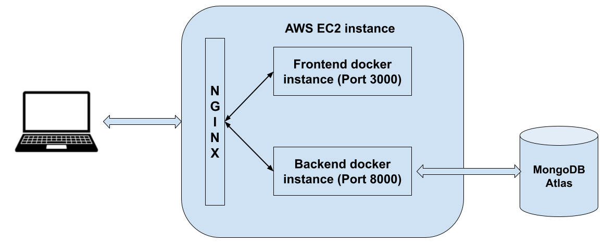

# Time-event-log Application

This application is a time management tool used to improve working efficiency. A registered user can use this App to record time and events of his or her daily. Thus, people can know exactly how their time are spend on everyday. In addition, some visual graphes can help to know whether a day is productive or not.

I originated this idea at the beginning of this pandemic. Students and employees are working at home without face-to-face supervision. In this case, people's working efficiency may suffer because of distraction on the Internet. Thus, I thought I could develop a tool to help people to monitor their time. After several months consistent efforts, I put this idea into product.

## Technologies

1. Front-end: React, Redux, Reactstrap.
2. Back-end: Node.js, Express.
3. User authentication: JSON Web Token.
4. Database: MongoDB.
5. Deployment: Backend deployed to AWS Elastic Beanstalk.

## Key features

1. Data visualization and timeline.
2. Local store data and reset function.
3. Save data to MongoDB database by press save button.
4. User registration and login.
5. Form validation.

## Demo

### Demo 1 Sign up and log in

### Demo 2 Main page and data visualization

### Demo 3 MongoDB database

## Available Scripts

In the project directory, you can run:

### `yarn start`

Runs the app in the development mode.\
Open [http://localhost:3000](http://localhost:3000) to view it in the browser.

The page will reload if you make edits.\
You will also see any lint errors in the console.

#### Diagram of this app

### How to use it and deploy it to AWS EC2

1. Change the related code in `fed-time-event-log` and `bed-time-event-log`
2. Open Docker desktop.
3. Build a corresponding image in the above two folders separately by the following commmand.
    `docker build -t lihaokx/time-event-log-bed:5 .`
    `docker build -t lihaokx/time-event-log-react:5 .`
4. The above `5` is the version tag of the image. We should in crease it every time we have a new update.
5. Then, run `docker push lihaokx/time-event-log-react:5`
6. Visit <https://hub.docker.com/repositories/lihaokx> we can see the new image we created just now.
7. Remember to change the beckend host to corresponding value.
    - `C:\MyOwnfiles\12_CS\React\time-event-log\docker-compose-time-event-log\fed-time-event-log\src\shared\url.js`
8. Visit parent fold by `cd ../`. Change the tag value in `compose.yaml` to corresponding value we created above. Use docker compose to build the containers(both locally and on EC2) by:
    `docker compose up --build -d`

9. We expose fed as port 3000, and expose bed as port 8000
10. Set the NGINX file(`/etc/nginx/sites-enabled/default`) in ec2 as follows. Literally, create a reverse proxy to redirect to port 8000 for backend api request, and redirect to port 3000 for other request

#### Common docker command
1. Build an image
   `docker build -t image-tag-name .`
2. Show all images
   `docker images`
3. Remove an image
   `docker rmi image-id-or-name`
4. Remove a container
   `docker rm container-id`
5. Show all containers 
   `docker ps`
6. Docker compose up and down
   - `docker compose up --build -d` (in the directory of compose.yaml)
   - `docker compose down`

#### NGINX command(add sudo in ec2)
1. NGINX status
   `systemctl status nginx`
2. Restart NGINX
   `systemctl restart nginx`
3. Test nginx(usually run after changing nginx file)
   `nginx -t`
4. See nginx log and error
   - `sudo tail /var/log/nginx/access.log`
   - `sudo tail /var/log/nginx/error.log`